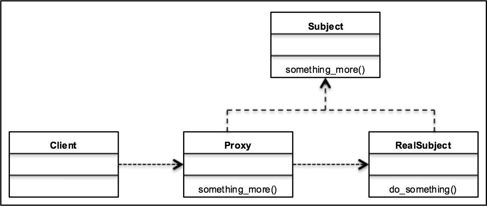

# Proxy

## Intent

Provide a surrogate or placeholder for another object to control access to it

**Type**

- Structural
- GOF

**Traits**

- Involves to objects: the originator and the caretaker.
- The originator represents the object whose state is being tracked
- The caretaker preforms operations on the originator but needs to able to undo/redo the operations
- Mementos should be `Value Objects` holding states but no behavior
- Only originator that created the memento should be assign or retrieve its state
- Memento sheilds other objects from potientially complex internal state of the `originator`
- Originator will have more simpler state managment
- Creating & restoring state maybe expensive.
  Memento may not be appropriate when state is large amount of information
- It may be difficult to ensure only the `Originator` can access `Memento's` internal state
- Caretaker responsible for managing `Mementos`, but has no idea how big or small they are,
  may not take the ideal decisions

**Advantages**

- Solid Principles
  - Single Responsibility - Object doesn't need to violate SRP to have the Redo/Undo functionality
  - Don't repeat yourself (DRY)
- OOP
  - Does not violate encapsluation priniciple

**Applicability**

- Undo
- Redo

**When to consider**

- Need to have Undo/Redo functionality
  - Memento holds the state of the originator
  - Ideally only originator should have access to the internal details of its state within the memento
  - Caretaker interface with the memento should not allow it to access the internal state of the originator
  - Originator can create Mementos or restore its given state
  - Caretaker maintains the the `memento` objects without operating on their contents (Manages the stack of operations)

**Alternative approach**

- Instead of storing state, store reverse operations
  - May require significantly fewer resources

**UML**

