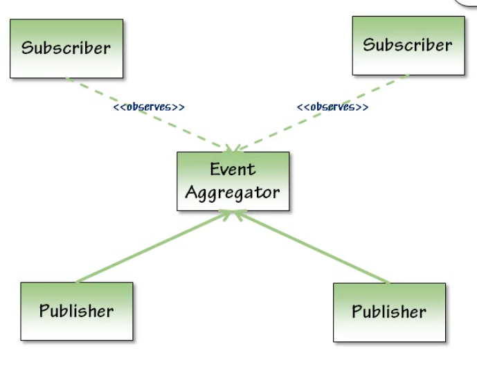

## Event Aggregator Pattern
- Publishers only know about the event aggregator not the subscribers 
- Subscribers observe the event aggregator 
- Publishers and subscribers each get to hold a reference to the aggregator 
- Publishers call publications methods to notify subscribers 
- Subscribers call subscription methods to receive notifications

### Intent 
- Simplify event registration by providing a single centralized store 
  * Making it easier for subscribers to discover events 
- Reduce coupling between publishers and subscribers 
  * Improve maintainability 
- Reduce friction for introducing new events 
  * Can add new events to the system, without knowing the source, that the event aggregator job
- Reduce memory management issues related to eventing

### Applicability 
- Having Many publishers, subscribers, and events
- New events added frequently 
- Building composite application 
  - apps that broken up to several modules, which are coordinating between one another 
    - Ex: Ordering app that have multiple modules such as Shipping module, Reporting module 
- Having complex screens, that could have sync between them 

### When to consider if you didn't start with it 
- When having publisher and subscribers are tightly coupled 
- When introducing new events / subscribers is difficult 
- When there's several implicit memory management issues
  - Ex: publishers have direct links to subscribers, you have to unregister manually

