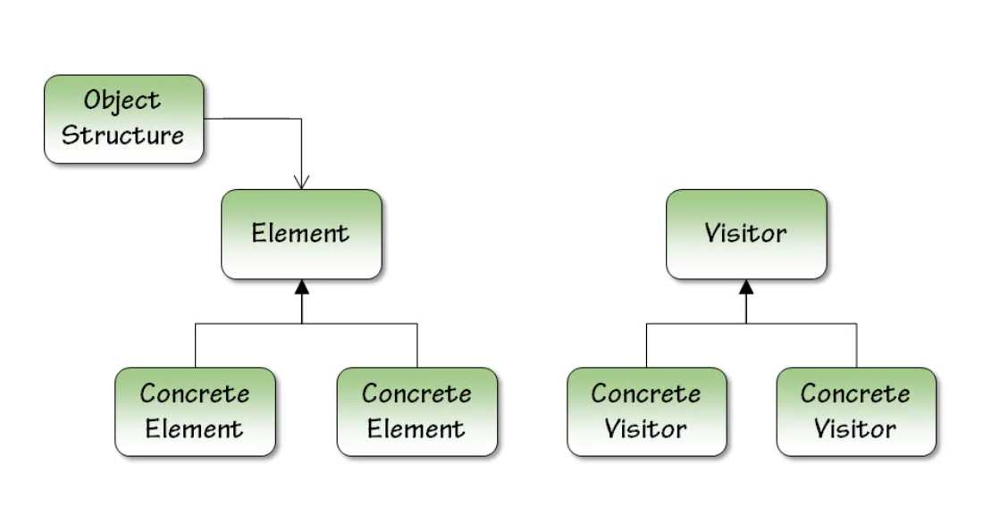

# Visitor
## Intent
Aim to separate algorithms from the objects on which they operate.

Represent an operation to be performed on the elements of an object structure (Object Structure means have a Tree, an Array, a Map ...etc). 
Visitor lets you define a new operation without changing the classes of the elements on which it operates. 

Ex: Comparators in Java follow a very similar pattern to visitor patterns (Mostly Startegy)

**Type**

- Behavioral 
- GOF 

**Traits**

- Various operations can be done on the elements (Asset interface in ex) on the object structure (Person class in ex)
- Customized behavior can be introduced by clients, just as Comparators in java 
- Not knowing all operations/algorithms ahead time of development

**Advantages**

- Solid Principles
  - Single Responsibility
    - Each visitor represents one algorithm
  - Open/Closed
    - Visitors can be added modified without a change in client code

**Applicability**

**When to consider**

- Having multiple operations that can be applied on the elements of an object structure 
  - Such as Balanced binary tree elements can be sorted, traversed with multiple ways 

**UML**

