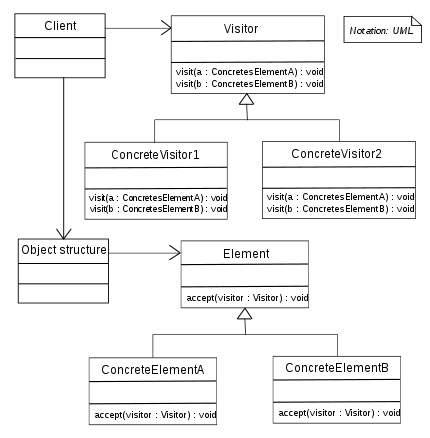

# Visitor
## Intent
Aim to separate algorithms from the objects on which they operate.

In Visitor pattern, we use a visitor class which changes the executing algorithm of an element class. 
By this way, execution algorithm of element can vary as and when visitor varies. 
This pattern comes under behavior pattern category. 
As per the pattern, element object has to accept the visitor object so that visitor object handles the operation on the element object.

**Type**

- Behavioral 
- GOF 

**Traits**

- 

**Advantages**

- 

**Applicability**

- 

**When to consider**

- 
 

**UML**

